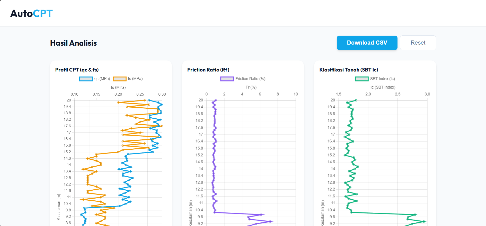

# AutoCPT - Analisis Data CPT Otomatis

**AutoCPT** adalah aplikasi web sederhana namun *powerful* untuk menganalisis data *Cone Penetration Test* (CPT) atau Sondir secara otomatis. Aplikasi ini dirancang untuk membantu insinyur geoteknik dalam melakukan klasifikasi tanah dan analisis potensi likuifaksi dengan cepat dan akurat.



## 🚀 Fitur Utama

*   **Upload Data Mudah**: Dukungan *Drag & Drop* untuk file `.csv` dan `.txt`.
*   **Konversi Satuan Otomatis**: Mendukung input data dalam satuan **MPa** atau **kg/cm²**.
*   **Visualisasi Interaktif**: Grafik dinamis menggunakan Chart.js untuk:
    *   Profil CPT ($q_c$ & $f_s$)
    *   Friction Ratio ($R_f$)
    *   Indeks Klasifikasi Tanah (SBT $I_c$)
    *   Faktor Keamanan Likuifaksi ($FS$)
*   **Analisis Likuifaksi**: Perhitungan otomatis potensi likuifaksi berdasarkan metode **Idriss & Boulanger (2008)**.
*   **Klasifikasi Tanah**: Klasifikasi jenis tanah berdasarkan metode **Robertson (1990/2010)**.
*   **Rekomendasi Perbaikan Tanah**: Memberikan saran metode perbaikan tanah (seperti *Vibro Compaction*, *PVD*, dll.) berdasarkan hasil analisis.
*   **Ekspor Hasil**: Unduh hasil analisis lengkap ke dalam format CSV.

## 🛠️ Teknologi yang Digunakan

*   **HTML5 & CSS3**: Struktur dan desain antarmuka yang responsif dan modern.
*   **JavaScript (Vanilla)**: Logika perhitungan dan interaktivitas.
*   **[Chart.js](https://www.chartjs.org/)**: Library untuk visualisasi grafik data sondir.
*   **[PapaParse](https://www.papaparse.com/)**: Library untuk parsing file CSV/TXT dengan cepat.

## 📋 Prasyarat & Instalasi

Aplikasi ini berjalan sepenuhnya di sisi klien (*client-side*) menggunakan browser. Anda tidak perlu menginstal server backend apa pun.

1.  **Clone repositori ini:**
    ```bash
    git clone https://github.com/richielagito/AutoCPT.git
    ```
2.  **Buka aplikasi:**
    Cukup buka file `index.html` menggunakan web browser modern (Google Chrome, Firefox, Edge, dll.).

## 📖 Cara Penggunaan

1.  **Siapkan Data CPT**: Pastikan data Anda dalam format `.csv` atau `.txt`.
2.  **Upload File**: Tarik dan lepas file ke area upload, atau klik untuk memilih file.
    *   *Tips: Anda bisa mencoba fitur ini dengan klik "Gunakan Data Contoh".*
3.  **Masukkan Parameter**: Isi parameter gempa dan tanah yang diperlukan:
    *   Satuan Input ($q_c$ & $f_s$)
    *   Muka Air Tanah (GWL)
    *   Magnitudo Gempa ($M_w$)
    *   Percepatan Tanah Puncak (PGA)
    *   Berat Isi Tanah ($\gamma_{sat}$)
4.  **Mulai Analisis**: Klik tombol "Mulai Analisis".
5.  **Lihat Hasil**: Eksplorasi grafik dan baca rekomendasi perbaikan tanah di bagian bawah.
6.  **Download**: Klik "Download CSV" untuk menyimpan hasil perhitungan.

## 📄 Format Data Input

File input harus memiliki header kolom yang jelas. Aplikasi akan mencoba mendeteksi kolom secara otomatis, namun format berikut sangat disarankan:

| Depth (m) | qc (MPa) | fs (MPa) |
| :--- | :--- | :--- |
| 0.20 | 1.50 | 0.05 |
| 0.40 | 2.10 | 0.08 |
| ... | ... | ... |

*   **Kolom Wajib**: Kedalaman (Depth), Tahanan Ujung (qc), Gesekan Selimut (fs).
*   **Pemisah (Delimiter)**: Koma (`,`) untuk CSV.

## 🔬 Metode Analisis

1.  **Klasifikasi Tanah (SBT)**: Menggunakan *Soil Behavior Type Index* ($I_c$) dari Robertson.
2.  **Analisis Likuifaksi**:
    *   Menghitung *Cyclic Stress Ratio* (CSR).
    *   Menghitung *Cyclic Resistance Ratio* (CRR) metode Idriss & Boulanger.
    *   Menghitung *Factor of Safety* ($FS = CRR / CSR$).
    *   Likuifaksi diprediksi terjadi jika $FS < 1.0$ pada lapisan pasir jenuh air.

## 📝 Lisensi

[MIT License](LICENSE) - Silakan gunakan dan modifikasi kode ini untuk keperluan edukasi atau proyek Anda.

---
Dikembangkan dengan ❤️ oleh Richie, Galang, Jalsson, dan Fernando.
